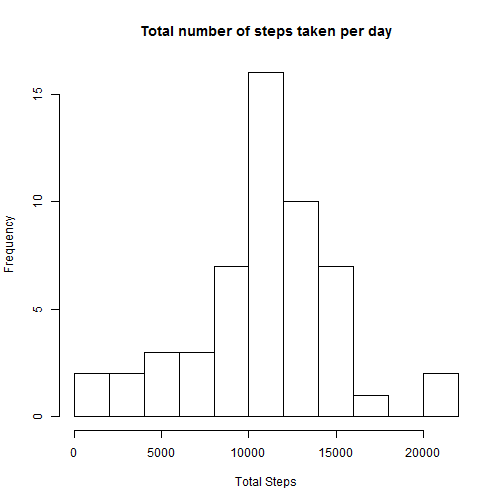
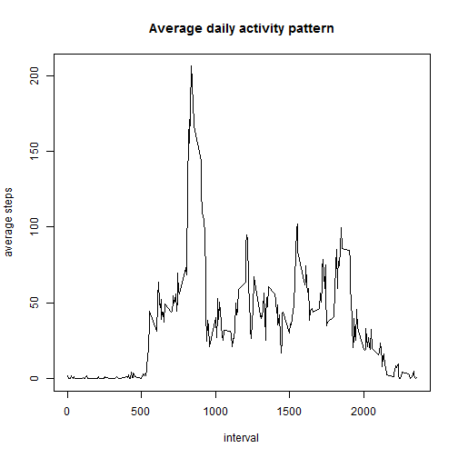
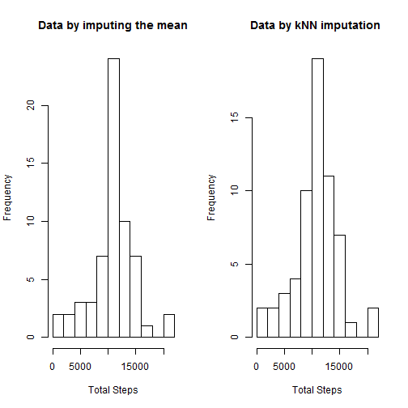
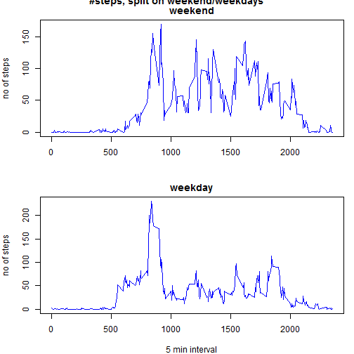

# Reproducible Research: Peer Assessment 1


## Loading and preprocessing the data


```r
rawdata<-read.csv("activity.csv") ## orginal data
refineData<-na.omit(rawdata) ## remove NA value data
summary(rawdata)
```

```
##      steps               date          interval   
##  Min.   :  0.0   2012-10-01:  288   Min.   :   0  
##  1st Qu.:  0.0   2012-10-02:  288   1st Qu.: 589  
##  Median :  0.0   2012-10-03:  288   Median :1178  
##  Mean   : 37.4   2012-10-04:  288   Mean   :1178  
##  3rd Qu.: 12.0   2012-10-05:  288   3rd Qu.:1766  
##  Max.   :806.0   2012-10-06:  288   Max.   :2355  
##  NA's   :2304    (Other)   :15840
```

```r
summary(refineData)
```

```
##      steps               date          interval   
##  Min.   :  0.0   2012-10-02:  288   Min.   :   0  
##  1st Qu.:  0.0   2012-10-03:  288   1st Qu.: 589  
##  Median :  0.0   2012-10-04:  288   Median :1178  
##  Mean   : 37.4   2012-10-05:  288   Mean   :1178  
##  3rd Qu.: 12.0   2012-10-06:  288   3rd Qu.:1766  
##  Max.   :806.0   2012-10-07:  288   Max.   :2355  
##                  (Other)   :13536
```

## What is mean total number of steps taken per day?

### 1. Make a histogram of the total number of steps taken each day


```r
##Total number of steps taken per day
Total.Steps<-tapply(rawdata$steps,rawdata$date,sum)
hist(Total.Steps,10,main="Total number of steps taken per day",xlab="Total Steps")
```

 

### 2. Calculate and report the mean and median total number of steps taken per day


```r
## print mean and median total number of steps taken per day
Total.Steps_mean<-mean(Total.Steps,na.rm=TRUE)
Total.Steps_median<-median(Total.Steps,na.rm=TRUE)
Total.Steps_mean
```

```
## [1] 10766
```

```r
Total.Steps_median
```

```
## [1] 10765
```

## What is the average daily activity pattern?

### 1. Make a time series plot of the 5-minute interval and the average number of steps taken.

```r
Pattern <- aggregate(refineData$steps, by=list(refineData$interval), FUN=mean)
plot(Pattern[,1],Pattern[,2],type="l",main="Average daily activity pattern",xlab="interval",ylab="average steps")
```

 

### 2. Which 5-minute interval, on average across all the days in the datase?


```r
Max_interval<-Pattern[which.max(Pattern[,2]),1] ## interval contains the maximum number of steps
Max_interval
```

```
## [1] 835
```

## Imputing missing values

### 1. Report the total number of missing values in the dataset

```r
## the total number of missing values in the dataset 
sum(is.na(rawdata$steps))
```

```
## [1] 2304
```

### 2. Devise a strategy for filling in all of the missing values in the dataset.

- I will use the 5-minute interval data of the average number of steps taken for filling missing values.
- And I will use also KnnImputation method using DmWR package.

### 3. Create a new dataset that is equal to the original dataset but with the missing data filled in.

```r
## The method is using the mean as a that 5-minute interval for filling
first_imputing<-rawdata
first_imputing$steps[is.na(first_imputing$steps)]<-Pattern[,2] ## using above pattern data
summary(first_imputing)
```

```
##      steps               date          interval   
##  Min.   :  0.0   2012-10-01:  288   Min.   :   0  
##  1st Qu.:  0.0   2012-10-02:  288   1st Qu.: 589  
##  Median :  0.0   2012-10-03:  288   Median :1178  
##  Mean   : 37.4   2012-10-04:  288   Mean   :1178  
##  3rd Qu.: 27.0   2012-10-05:  288   3rd Qu.:1766  
##  Max.   :806.0   2012-10-06:  288   Max.   :2355  
##                  (Other)   :15840
```

```r
##install.packages("DMwR")
library(DMwR)
second_imputing<-knnImputation(rawdata)
summary(second_imputing)
```

```
##      steps               date          interval   
##  Min.   :  0.0   2012-10-01:  288   Min.   :   0  
##  1st Qu.:  0.0   2012-10-02:  288   1st Qu.: 589  
##  Median :  0.0   2012-10-03:  288   Median :1178  
##  Mean   : 36.9   2012-10-04:  288   Mean   :1178  
##  3rd Qu.: 19.2   2012-10-05:  288   3rd Qu.:1766  
##  Max.   :806.0   2012-10-06:  288   Max.   :2355  
##                  (Other)   :15840
```

### 4. Make a histogram of the total number of steps taken each day and report the mean and median


```r
first_imputing.Steps<-tapply(first_imputing$steps,first_imputing$date,sum)
first_imputing.Steps_mean<-mean(first_imputing.Steps,na.rm=TRUE)
first_imputing.Steps_median<-median(first_imputing.Steps,na.rm=TRUE)
second_imputing.Steps<-tapply(second_imputing$steps,second_imputing$date,sum)
second_imputing.Steps_mean<-mean(second_imputing.Steps,na.rm=TRUE)
second_imputing.Steps_median<-median(second_imputing.Steps,na.rm=TRUE)
par(mfrow=c(1,2))
hist(first_imputing.Steps,10,main="Data by imputing the mean",xlab="Total Steps")
hist(second_imputing.Steps,10,main="Data by kNN imputation ",xlab="Total Steps")
```

 

========================================================================================================

```r
paste("The means of original data and impuing data are",Total.Steps_mean,",",first_imputing.Steps_mean,"and",second_imputing.Steps_mean)
```

```
## [1] "The means of original data and impuing data are 10766.1886792453 , 10766.1886792453 and 10637.8459326874"
```

```r
paste("The medians of original data and impuing data are",Total.Steps_median,",",first_imputing.Steps_median,"and",second_imputing.Steps_median)
```

```
## [1] "The medians of original data and impuing data are 10765 , 10766.1886792453 and 10600"
```

## Are there differences in activity patterns between weekdays and weekends?


### 1. Create a new factor variable in the dataset with two levels -- "weekday" and "weekend"


```r
## Create a new factor variable in the dataset with two levels 
## ¡°weekday¡± and ¡°weekend¡± 
Sys.setlocale("LC_TIME", "English")
```

```
## [1] "English_United States.1252"
```

```r
week<-ifelse(weekdays(as.Date(second_imputing$date))=="Sunday"|weekdays(as.Date(second_imputing$date))=="Saturday","weekend","weekday")
week<-as.factor(week)
newdata<-cbind(second_imputing,week)
summary(newdata)
```

```
##      steps               date          interval         week      
##  Min.   :  0.0   2012-10-01:  288   Min.   :   0   weekday:12960  
##  1st Qu.:  0.0   2012-10-02:  288   1st Qu.: 589   weekend: 4608  
##  Median :  0.0   2012-10-03:  288   Median :1178                  
##  Mean   : 36.9   2012-10-04:  288   Mean   :1178                  
##  3rd Qu.: 19.2   2012-10-05:  288   3rd Qu.:1766                  
##  Max.   :806.0   2012-10-06:  288   Max.   :2355                  
##                  (Other)   :15840
```

### 2. Make a panel plot containing a time series plot.


```r
newPattern <- aggregate(newdata$steps, by=list(newdata$interval,newdata$week), FUN=mean)
colnames(newPattern)<-c("interval","week_type","activity")
weekend_data<-subset(newPattern,newPattern$week_type=="weekend")
weekday_data<-subset(newPattern,newPattern$week_type=="weekday")
par(mfrow=c(2,1),mar=c(4,4,2,1))
plot(weekend_data$interval,weekend_data$activity,type="l", xlab="", ylab="no of steps", main="weekend",col="blue")
title(main="#steps, split on weekend/weekdays", outer=TRUE)    
plot(weekday_data$interval,weekday_data$activity,type="l", xlab="5 min interval", ylab="no of steps", main="weekday",col="blue")
```

 

